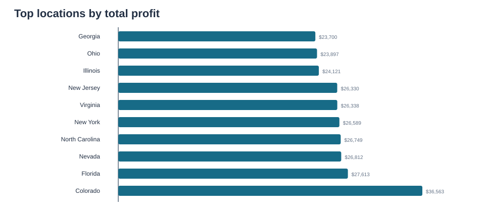
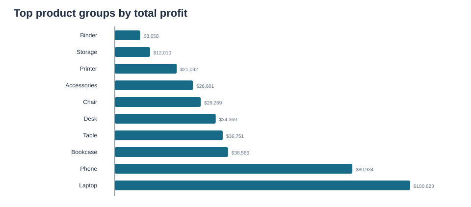
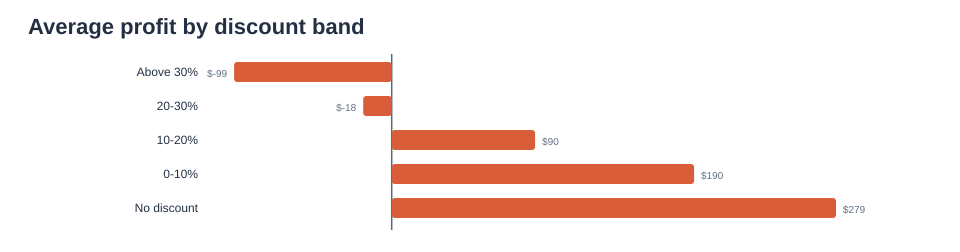

# Proto Folio

### A Personal Portfolio & Project Repository by Faiz Muhammad Zubair

## About
**Proto Folio** is my personal portfolio repository showcasing projects built with Python and Streamlit. 
This repository serves as a central hub for my coding work, including web applications, data analysis, 
and creative multimedia projects.

## Technologies
- **Python 3.x**
- **Streamlit** - For building interactive web applications
- **Jupyter Notebook** - For data analysis and prototyping
- **Multimedia** - GIF, MP
- ## Repository Structure

| File | Description |
| --- | --- |
| `Untitled-1.py` | Python scripts and practice exercises |
| `Untitled-2.ipynb` | Main Streamlit Portfolio Application |
| 
## Getting Started

### Prerequisites
```bash
pip install streamlit pandas numpy


# Faiz Muhammad Zubair
## Python Data Analytics Portfolio

Independent portfolio case studies using Python and SQL to explore retail profitability and SaaS revenue and retention. Each project includes its own notebook, documentation, dependencies, and analysis outputs.

**Featured projects:** [Retail Sales Profitability](sales_profitability_portfolio/README.md) · [SaaS Revenue and Retention](saas_retention_portfolio/README.md)

> **Data transparency:** Both projects use simulated data. All figures and patterns below describe the included simulations; they are not results from real companies or customers.

## Project 1 — Retail Sales Profitability Analysis

**Business question:** How does profit vary by product group, state, and discount level?

This project uses Python, pandas, SQLite/SQL, and Matplotlib to inspect data quality and compare profit across simulated retail transactions.

### Method

- Load and inspect 2,500 simulated retail line items.
- Check missing analysis values and exact duplicates; retain rows with the required product, profit, and discount fields.
- Use SQL to summarize profit by state and product group.
- Compare average and total profit across discount bands.
- Export summary tables, SQL queries, and charts.

### Sample results

| Measure | Result |
|---|---:|
| Input line items | 2,500 |
| Rows excluded for missing required values | 32 |
| Rows retained for analysis | 2,468 |
| Exact duplicate rows | 0 |
| Highest-profit state in the sample | Colorado — $36,563.26 |
| Highest-profit product group in the sample | Laptop — $100,623.22 |
| Average profit with no discount | $278.71 per line item |
| Average profit above 30% discount | −$98.86 per line item |

The generator deliberately makes high discounts reduce profit margins. Therefore, the discount pattern is built into the simulated data and does not show that discounts caused lower profit in a real business.

### Visualisations







**Project files:** [README](sales_profitability_portfolio/README.md) · [Notebook](sales_profitability_portfolio/sales_profitability_analysis.ipynb) · [Data](sales_profitability_portfolio/data/) · [Outputs](sales_profitability_portfolio/outputs/)

## Project 2 — SaaS Revenue and Retention Analysis

**Business question:** How do monthly recurring revenue (MRR), cancellations, and retention change over time and across subscription plans?

This project uses Python, pandas, NumPy, SQLite/SQL, and Matplotlib to generate and analyse 500 simulated subscriptions.

### Method

- Generate reproducible customer and subscription records.
- Validate identifiers, customer links, dates, and cancellation dates.
- Calculate month-end MRR, active subscriptions, and monthly churn.
- Compare cumulative cancellations by plan and calculate cohort retention.
- Export analysis tables and charts.

### Sample results

- Month-end MRR rose from **€576** in January 2023 to **€12,830** in December 2025.
- December 2025 churn was **4.5%**: 16 cancellations out of 356 subscriptions active at the start of the month.
- Cumulative cancellation rates were **32.7% for Business**, **31.8% for Pro**, and **28.4% for Basic** in this sample.

These are simulated results. Plan comparisons are descriptive, may reflect differences in subscription tenure, and do not explain why customers cancel.

### Visualisations


**Project files:** [README](saas_retention_portfolio/README.md) · [Notebook](saas_retention_portfolio/saas_retention_analysis.ipynb) · [Outputs](saas_retention_portfolio/outputs/)

## Skills demonstrated

- Python data analysis with pandas and NumPy
- SQL aggregation with SQLite
- Data quality checks and missing-value handling
- Business metrics: profit, MRR, churn, and cohort retention
- Exploratory analysis, visualisation, and written interpretation
- Reproducible workflows with project-specific dependencies

## Run the projects

Clone the repository, then install dependencies and run each project from its own folder.

### Retail Sales Profitability

```bash
git clone https://github.com/faizmuhammadzubair5-dot/proto-folio.git
cd proto-folio/sales_profitability_portfolio
python -m pip install -r requirements.txt
```

The sample CSV is included. To regenerate it, run `python generate_sample_data.py` from the sales project folder. Open `sales_profitability_analysis.ipynb` in VS Code with the Jupyter extension or in Jupyter, then run all cells.

### SaaS Revenue and Retention

From the repository root, install the SaaS project dependencies:

```bash
cd saas_retention_portfolio
python -m pip install -r requirements.txt
```

Open `saas_retention_analysis.ipynb` in VS Code with the Jupyter extension or in Jupyter, then run all cells. The notebook generates its simulated data. See the [SaaS project README](saas_retention_portfolio/README.md) for details.

On Windows, use `py -m pip install -r requirements.txt` if the `python` command is unavailable. If Jupyter is not installed, install it separately with `python -m pip install jupyterlab`.

## Limitations

- Both datasets are simulated; they do not represent real business performance.
- The sales generator intentionally encodes the high-discount / lower-margin pattern.
- Sales counts are line items, not distinct orders.
- The analyses are descriptive and do not establish causation.
- Describe these as independent projects using simulated data when including them on a CV.

