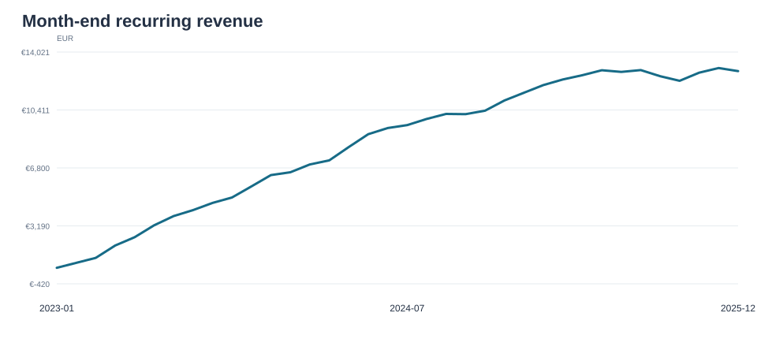
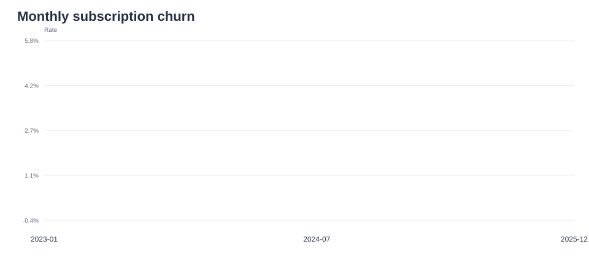
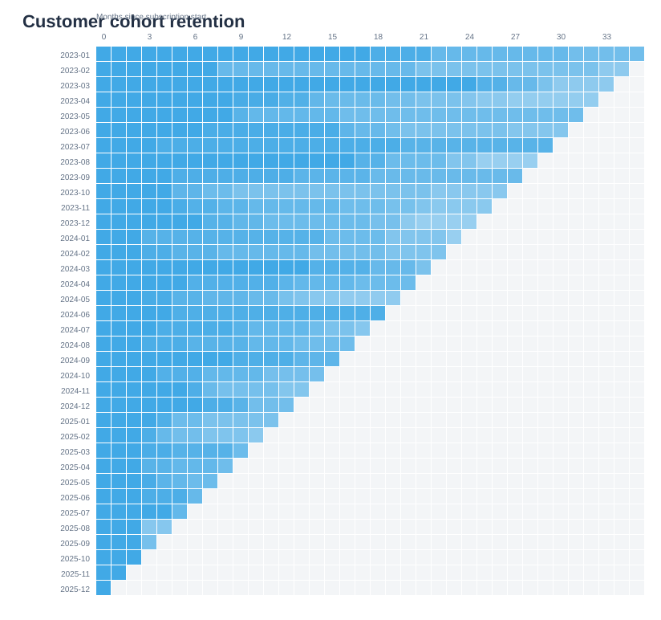

# SaaS Revenue and Retention Analysis

## Question
How do monthly recurring revenue, cancellations, and retention change over time and across subscription plans?

## Data and tools
The notebook generates a deterministic simulated subscription dataset. It uses Python, pandas, NumPy, SQLite, SQL, and Matplotlib.

## Results from the included simulated sample
- Month-end MRR increased from €576 in January 2023 to €12,830 in December 2025.
- December 2025 churn was 16 cancellations out of 356 subscriptions active at the start of the month (4.5%).
- Cumulative cancellations were 16/49 for Business (32.7%), 55/173 for Pro (31.8%), and 79/278 for Basic (28.4%).

These are simulated values. Plan differences are descriptive and do not establish why customers cancel.

## Chart previews

## Run
Install the packages in requirements.txt, open saas_retention_analysis.ipynb from this folder, and run all cells. Tables and PNG charts are saved in outputs/.

## Limitations
Records are synthetic, not real customer or company data. The sample cannot support real business conclusions or causal claims.
